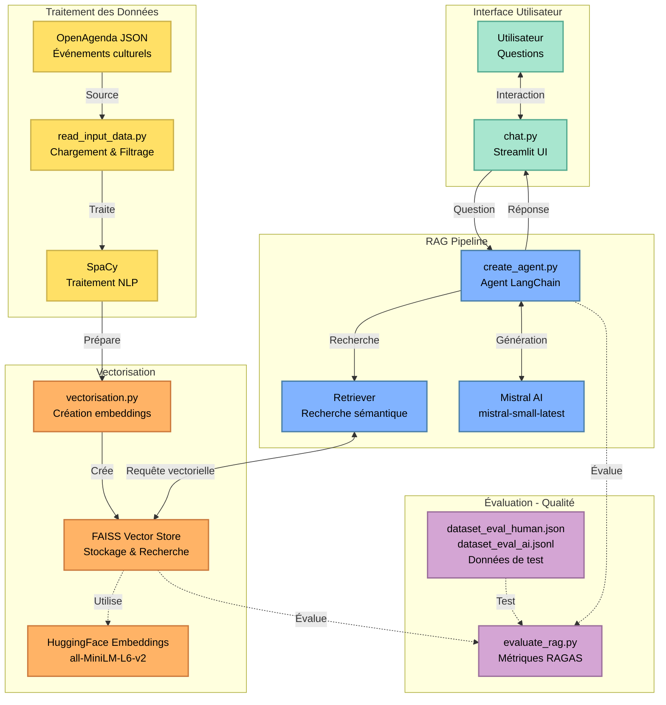

# RAG Chatbot - Événements Culturels de Lille

Un chatbot intelligent basé sur RAG (Retrieval-Augmented Generation) pour répondre aux questions sur les événements culturels à Lille en 2025.

## Vue d'ensemble du projet



## Description

Ce projet implémente un système de chatbot utilisant l'architecture RAG pour fournir des informations précises sur les événements culturels à Lille. Le système utilise :
- **LangChain** pour l'orchestration du workflow RAG
- **SpaCy** (`fr_core_news_sm`) pour le traitement du texte en français
- **FAISS** (IndexIVFFlat avec 21 clusters) pour le stockage et la recherche vectorielle optimisée
- **HuggingFace Embeddings** (`all-MiniLM-L6-v2`) pour la vectorisation des documents
- **Mistral AI** (`mistral-small-latest`) pour la génération de réponses
- **Streamlit** pour l'interface utilisateur interactive
- **RAGAS** pour l'évaluation de la qualité du système RAG

## Architecture

Le projet est organisé comme suit :

```
projet_11_RAG/
├── chat.py                 # Interface Streamlit du chatbot
├── evaluate_rag.py         # Évaluation des performances du RAG
├── src/
│   ├── read_input_data.py  # Chargement et traitement des données
│   └── vectorisation.py    # Création et gestion du vector store
├── data/                   # Données des événements (JSON)
├── vectorstore/            # Base de données vectorielle FAISS
├── evaluation/             # Dataset d'évaluation
└── tests/                  # Tests unitaires
```

## Installation

### Prérequis

- Python 3.13+
- pip

### Étapes d'installation

1. Cloner le repository :
```bash
git clone <repository-url>
cd projet_11_RAG
```

2. Créer un environnement virtuel :
```bash
python -m venv venv
source venv/bin/activate  # Sur macOS/Linux
# ou
venv\Scripts\activate     # Sur Windows
```

3. Installer les dépendances :
```bash
pip install -r requirements.txt
```

4. Télécharger le modèle SpaCy français :
```bash
python -m spacy download fr_core_news_sm
```

5. Configurer les variables d'environnement :
Créer un fichier `.env` à la racine du projet avec :
```
MISTRAL_API_KEY=votre_clé_api_mistral
```
Vous pouvez rajouter les informations Langsmith si vous souhaitez l'utiliser.

## Utilisation

### Lancer le chatbot Streamlit

```bash
streamlit run chat.py
```

Le chatbot sera accessible à l'adresse : `http://localhost:8501`

### Initialiser ou mettre à jour la base vectorielle

La base vectorielle existe déjà dans le dossier vectorstore/faiss_openagenda_index.
Il est possible de la supprimer et elle sera recréée enc hargeant les données des événements depuis `data/evenements-publics-openagenda.json` et les filtre (Lille, 2025)

### Évaluer les performances du RAG

```bash
python evaluate_rag.py
```

L'évaluation peut être effectuée avec deux datasets différents :
- **Dataset humain** : `evaluation/dataset_eval_human.json` - Questions/réponses créées manuellement
- **Dataset IA** : `evaluation/dataset_eval_ai.jsonl` - Questions/réponses générées automatiquement 

Pour changer de dataset, modifiez la variable `use_ai_generated_dataset` dans `evaluate_rag.py`.

#### Métriques RAGAS évaluées :
- **Faithfulness** : Fidélité de la réponse par rapport au contexte récupéré
- **Answer Relevancy** : Pertinence de la réponse à la question posée
- **Context Recall** : Capacité à récupérer les informations nécessaires
- **Context Precision** : Précision du contexte récupéré
- **Context Relevance** : Pertinence du contexte par rapport à la question

Les résultats sont sauvegardés dans :
- `evaluation/human_evaluation_results.csv` (pour le dataset humain)
- `evaluation/ai_evaluation_results.csv` (pour le dataset IA) 

## Tests

Lancer tous les tests :
```bash
pytest
```

## Données

Le projet utilise des données d'événements culturels au format JSON provenant d'OpenAgenda.

### Caractéristiques des données :
- **Source** : `data/evenements-publics-openagenda-full.json`
- **Filtre géographique** : Lille
- **Filtre temporel** : Année 2025

## Configuration

**Modèle LLM :**
- Fournisseur : Mistral AI
- Modèle : `mistral-small-latest`

**Embeddings :**
- Modèle : `all-MiniLM-L6-v2` (HuggingFace)

**Base vectorielle FAISS :**
- Type d'index : `IndexIVFFlat` (Inverted File with Flat Quantizer)
- Nombre de clusters : 21
- Nprobe : 7 (nombre de clusters à visiter lors de la recherche)

**Traitement du texte :**
- Splitter : `SpacyTextSplitter` - `fr_core_news_sm` 