# RAG Chatbot - Événements Culturels de Lille

Un chatbot intelligent basé sur RAG (Retrieval-Augmented Generation) pour répondre aux questions sur les événements culturels à Lille en 2025.

## Vue d'ensemble du projet

```mermaid
graph TD
    subgraph "Interface Utilisateur"
        K[Utilisateur<br/>Questions]
        J[chat.py<br/>Streamlit UI]
    end
    
    K <-->|Interaction| J
    
    subgraph "RAG Pipeline"
        G[create_agent.py<br/>Agent LangChain]
        H[Retriever<br/>Recherche sémantique]
        I[Mistral AI<br/>mistral-small-latest]
    end
    
    J -->|Question| G
    G -->|Recherche| H
    G <-->|Génération| I
    G -->|Réponse| J
    
    subgraph "Vectorisation"
        F[FAISS Vector Store<br/>Stockage & Recherche]
        E[HuggingFace Embeddings<br/>all-MiniLM-L6-v2]
        D[vectorisation.py<br/>Création embeddings]
    end
    
    H <-->|Requête vectorielle| F
    F -.->|Utilise| E
    D -->|Crée| F
    
    subgraph "Traitement des Données "
        C[SpaCy<br/>Traitement NLP]
        B[read_input_data.py<br/>Chargement & Filtrage]
        A[OpenAgenda JSON<br/>Événements culturels]
    end
    
    B -->|Traite| C
    C -->|Prépare| D
    A -->|Source| B
    
    subgraph "Évaluation - Qualité"
        L[evaluate_rag.py<br/>Métriques RAGAS]
        M[dataset_eval.json<br/>Données de test]
    end
    
    G -.->|Évalue| L
    F -.->|Évalue| L
    M -.->|Test| L
    
    %% Interface Utilisateur - Vert clair
    style K fill:#a8e6cf,stroke:#56ab91,stroke-width:2px,color:#000
    style J fill:#a8e6cf,stroke:#56ab91,stroke-width:2px,color:#000
    
    %% RAG Pipeline - Bleu clair
    style G fill:#81b3ff,stroke:#4a7fa8,stroke-width:2px,color:#000
    style H fill:#81b3ff,stroke:#4a7fa8,stroke-width:2px,color:#000
    style I fill:#81b3ff,stroke:#4a7fa8,stroke-width:2px,color:#000
    
    %% Vectorisation - Orange clair
    style F fill:#ffb366,stroke:#cc7a3d,stroke-width:2px,color:#000
    style E fill:#ffb366,stroke:#cc7a3d,stroke-width:2px,color:#000
    style D fill:#ffb366,stroke:#cc7a3d,stroke-width:2px,color:#000
    
    %% Traitement des Données - Jaune clair
    style C fill:#ffe066,stroke:#ccb34d,stroke-width:2px,color:#000
    style B fill:#ffe066,stroke:#ccb34d,stroke-width:2px,color:#000
    style A fill:#ffe066,stroke:#ccb34d,stroke-width:2px,color:#000
    
    %% Évaluation - Violet clair
    style L fill:#d4a5d4,stroke:#9c6f9c,stroke-width:2px,color:#000
    style M fill:#d4a5d4,stroke:#9c6f9c,stroke-width:2px,color:#000
```



## Description

Ce projet implémente un système de chatbot utilisant l'architecture RAG pour fournir des informations précises sur les événements culturels à Lille. Le système utilise :
- **LangChain** pour l'orchestration du workflow RAG
- **Spacy** pour le traitement du texte en français
- **FAISS** pour le stockage et la recherche vectorielle
- **Mistral AI** pour les embeddings et la génération de réponses
- **Streamlit** pour l'interface utilisateur interactive

## Architecture

Le projet est organisé comme suit :

```
projet_11_RAG/
├── chat.py                 # Interface Streamlit du chatbot
├── evaluate_rag.py         # Évaluation des performances du RAG
├── src/
│   ├── read_input_data.py  # Chargement et traitement des données
│   └── vectorisation.py    # Création et gestion du vector store
├── data/                   # Données des événements (JSON)
├── vectorstore/            # Base de données vectorielle FAISS
├── evaluation/             # Dataset d'évaluation
└── tests/                  # Tests unitaires
```

## Installation

### Prérequis

- Python 3.13+
- pip

### Étapes d'installation

1. Cloner le repository :
```bash
git clone <repository-url>
cd projet_11_RAG
```

2. Créer un environnement virtuel :
```bash
python -m venv venv
source venv/bin/activate  # Sur macOS/Linux
# ou
venv\Scripts\activate     # Sur Windows
```

3. Installer les dépendances :
```bash
pip install -r requirements.txt
```

4. Télécharger le modèle SpaCy français :
```bash
python -m spacy download fr_core_news_sm
```

5. Configurer les variables d'environnement :
Créer un fichier `.env` à la racine du projet avec :
```
MISTRAL_API_KEY=votre_clé_api_mistral
```
Vous pouvez rajouter les informations Langsmith si vous souhaitez l'utiliser.

## Utilisation

### Lancer le chatbot Streamlit

```bash
streamlit run chat.py
```

Le chatbot sera accessible à l'adresse : `http://localhost:8501`

### Initialiser ou mettre à jour la base vectorielle

La base vectorielle existe déjà.
Il est possible de la supprimer et elle sera recréée enc hargeant les données des événements depuis `data/evenements-publics-openagenda.json` et les filtre (Lille, 2025)

### Évaluer les performances du RAG

```bash
python evaluate_rag.py
```

L'évaluation peut être effectuée à partir de questions/réponses générées par humain, dans le fichier dataset_eval_human, mais également par un dataset créé par l'IA dataset_eval_ai.

Évalue le système RAG avec les métriques RAGAS :
- Faithfulness 
- Answer Relevancy 
- Context Recall 
- Answer Correctness 
- Context Relevance 

## Tests

Lancer tous les tests :
```bash
pytest
```

Lancer des tests spécifiques :
```bash
pytest tests/test_read_input_data.py
pytest tests/test_vectorisation.py
pytest tests/test_rag.py
```

## Données

Le projet utilise des données d'événements culturels au format JSON provenant d'OpenAgenda. Les données sont filtrées pour :
- **Ville** : Lille
- **Année** : 2025

## Configuration

Les principaux paramètres configurables :

- **Modèle LLM** : `mistral-small-latest`
- **Modèle d'embeddings** : HuggingFaceEmbeddings: `all-MiniLM-L6-v2`
- **Nombre de documents récupérés (k)** : 2-5 selon le contexte
